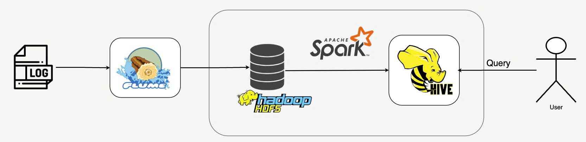

# NasaLog-Analysis
## Architecture

  <center>
      
  </center>
  
## Data Source
1. [ftp://ita.ee.lbl.gov/traces/NASA_access_log_Jul95.gz](ftp://ita.ee.lbl.gov/traces/NASA_access_log_Jul95.gz)
2. [ftp://ita.ee.lbl.gov/traces/NASA_access_log_Aug95.gz](ftp://ita.ee.lbl.gov/traces/NASA_access_log_Aug95.gz)

## Run Project
### Start Flume
  ```
  flume-ng agent --name myagent --conf-file config_flume/file2hdfs.conf -Dflume.root.logger=INFO,console
  ```

### Start Spark
```
spark-submit --master spark://localhost:7077 pySpark/processingLog.py
```

## Result
Can run query with Hive
